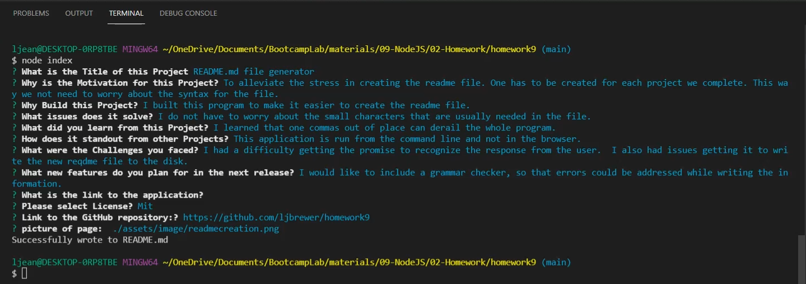

-----------------------------------------

## Table of Contents

* [Title](#Title)
* [Motivation](#Motivation)
    * [Why this application what created](#Why-was-this-application-created)
    * [Issues](#Issues)
* [What was Learned](#What-was-Learned)
    * [What Stands out in this program](#What-Stands-out-in-this-program)
* [Challenges that were faced](#Challenges-that-were-faced)
    * [New Features](#New-Features)
* [link to video](#link-to-video)
* [License](#License)
* [Link to GitHub](#Link-to-GitHub)
* [picture of page](#picture-of-page)

-----------------------------------------

## Description

------------------------------    
### Title
README.md file generator

--------------------------------------------------------------------------------
### Motivation
To alleviate the stress in creating the readme file. One has to be created for each project we complete. This way we not need to worry about the syntax for the file.

--------------------------------------------------------------------------------
### Why was this application created
 I built this program to make it easier to create the readme file. I built this program to make it easier to create the readme file.

--------------------------------------------------------------------------------
### Issues 
I do not have to worry about the small characters that are usually needed in the file.

--------------------------------------------------------------------------------
### What was Learned
I learned that one commas out of place can derail the whole program.

--------------------------------------------------------------------------------
### What Stands out in this program 
This application is run from the command line and not in the browser.

--------------------------------------------------------------------------------
### Challenges that were faced 
I had a difficulty getting the promise to recognize the response from the user.  I also had issues getting it to write the new reqdme file to the disk.

--------------------------------------------------------------------------------
### New Features 
I would like to include a grammar checker, so that errors could be addressed while writing the information.

--------------------------------------------------------------------------------
### link to video     
https://drive.google.com/file/d/1WtAgIW693TSPCh9x7U5yO4U-ac_rrqkV/view

--------------------------------------------------------------------------------
### License 
This application is covered under the: Mit license.

--------------------------------------------------------------------------------

### Link to GitHub repository https://github.com/ljbrewer/homework9

--------------------------------------------------------------------------------
### picture of page:

#### Features of this program: It runs from the command line and it prompts the user to answer questions about the readme file they need created.

#### Tests: I tested it by running it from the command line many times.

#### Credits: This program was created by Laura Brewer

